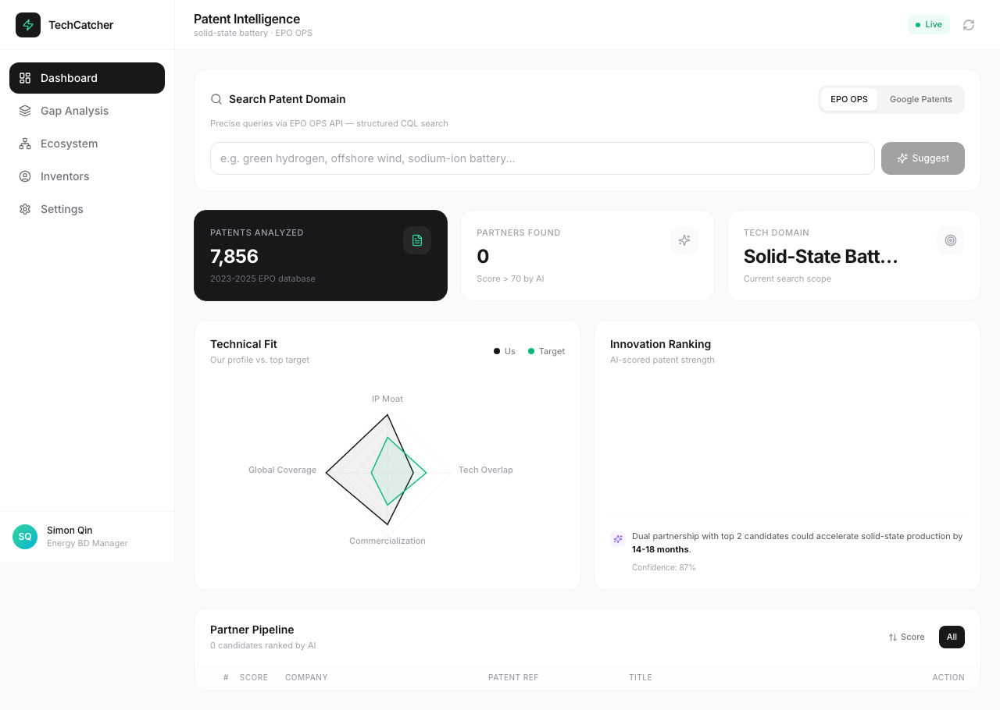
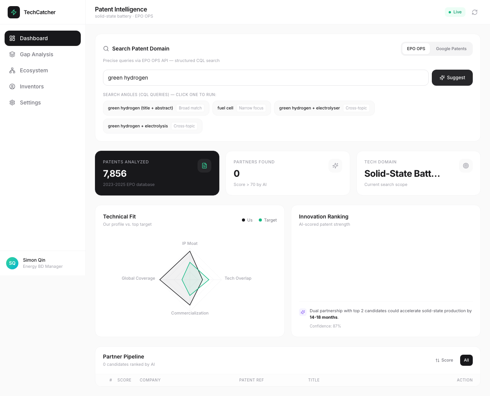
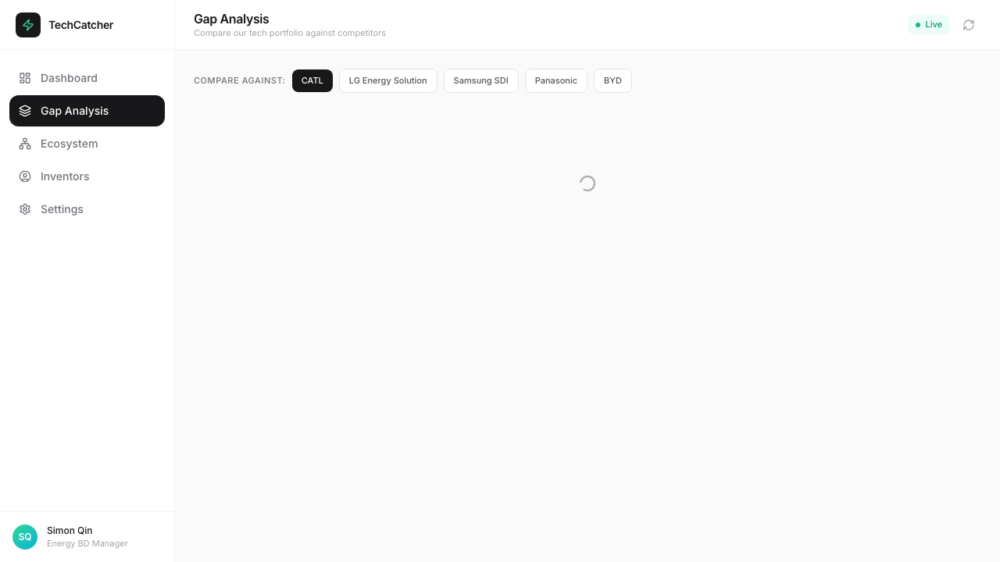
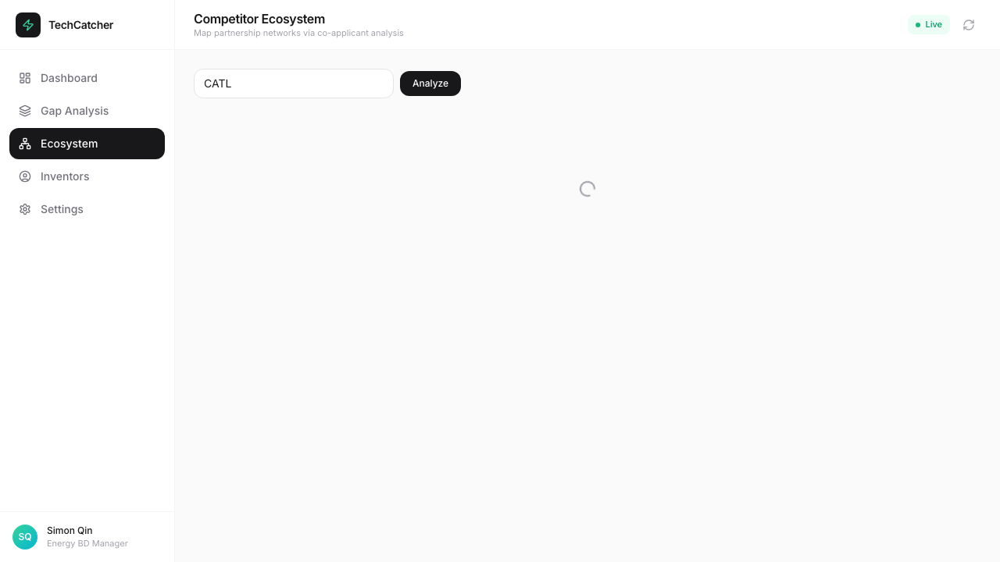

<p align="center">
  
  
  
  
  
</p>

<h1 align="center">TechCatcher</h1>

<p align="center">
  Patent search and competitive intelligence for the energy industry.<br>
  EPO OPS + Google Patents. One dashboard. No noise.
</p>

<p align="center">
  <a href="#what-it-does">What It Does</a> ·
  <a href="#screenshots">Screenshots</a> ·
  <a href="#get-started">Get Started</a> ·
  <a href="#how-it-works">How It Works</a> ·
  <a href="#api">API</a>
</p>

---

## What it does

Type any energy topic — green hydrogen, offshore wind, sodium-ion battery — and TechCatcher searches patent databases, scores the results, and maps who's doing what.

It pulls from two sources:

- **EPO OPS** — official European Patent Office API. Structured CQL queries, IPC classification, precise filtering. Rate-limited (4 req / 2.5s).
- **Google Patents** — scraped via [Scrapling](https://github.com/niespodd/scrapling) with anti-bot bypass. No API quota. Good for broad sweeps.

Toggle between them. Same UI, different data.

**What you get:**

| Feature | What it tells you |
|---------|-------------------|
| Smart Search | Expands your topic into 5 search strategies. Click one, get results. |
| Innovation Score | Every patent scored on tech specificity, citation density, commercial signals. |
| Gap Analysis | Compare your portfolio against a competitor. See overlaps and blind spots. |
| Ecosystem Map | Enter a company — see who they co-file patents with, which inventors they work with. |
| Inventor Ranking | Who's publishing the most in a domain. Useful for hiring or licensing. |
| Partner Pipeline | Top candidates ranked, with suggested actions (BD call, M&A watch, deep dive). |

## Screenshots

<p align="center">
  
  <br><em>Dashboard — innovation ranking, radar comparison, partner pipeline</em>
</p>

<p align="center">
  
  <br><em>Smart search — topic expansion with clickable search strategies</em>
</p>

<p align="center">
  
  <br><em>Gap analysis — competitor complementarity and technology overlap</em>
</p>

<p align="center">
  
  <br><em>Ecosystem — co-applicant network and technology focus areas</em>
</p>

## Get started

```bash
git clone https://github.com/sinonchum/tech-catcher.git
cd tech-catcher
```

**Frontend** (React + Vite):
```bash
npm install
npm run dev              # http://localhost:3000
```

**Backend** (Express):
```bash
cd server
cp config.example.json config.json
# Put your EPO credentials in config.json, or leave blank to skip EPO
npm install
node index.js            # http://localhost:3001
```

**Google Patents scraper** (optional, needed for Google data source):
```bash
pip install scrapling
```

EPO credentials are free — register at [developers.epo.org](https://developers.epo.org/). Google Patents needs nothing.

## How it works

```
Browser ──→ Vite (3000) ──→ Express (3001) ──→ EPO OPS (OAuth2 + CQL)
                              │                └→ Google Patents (Scrapling + Chromium)
                              │
                              └→ SQLite (local cache, 24h TTL)
```

**Frontend:** React 18, Tailwind CSS, Recharts for charts, Lucide for icons.

**Backend:** Express in ESM mode. SQLite via better-sqlite3 for local caching — avoids hammering EPO's rate limiter on repeat queries.

**Scraping:** Python script using Scrapling's StealthyFetcher. Launches headless Chromium, handles Cloudflare/bot detection, parses patent results from Google Patents HTML. Regex-based DOM parsing since Google Patents uses web components.

**Rate limiting:** EPO's free tier is 4 requests per 2.5 seconds. The backend enforces this with configurable delay, burst protection (4 req → 10s pause), and exponential backoff on RobotDetected errors. Google Patents has no such limit.

## API

| Endpoint | Method | Description |
|----------|--------|-------------|
| `/api/suggest` | POST | Topic → search angle expansion (local, no API call) |
| `/api/patents/search` | GET | EPO OPS patent search (CQL) |
| `/api/patents/google` | GET | Google Patents via Scrapling |
| `/api/analysis/gap` | GET | Competitor gap analysis |
| `/api/analysis/ecosystem` | GET | Co-applicant and inventor network |
| `/api/analysis/inventors` | GET | Inventor leaderboard by domain |
| `/api/settings` | GET/PUT | Configuration (credentials, rate limits) |
| `/api/db/stats` | GET | Cache stats, API call counts |
| `/api/export/json` | GET | Export cached patents |
| `/api/export/csv` | GET | Export cached patents |

## Configuration

```json
{
  "epo": {
    "consumerKey": "YOUR_KEY",
    "consumerSecret": "YOUR_SECRET"
  },
  "rateLimit": {
    "requestDelayMs": 2500,
    "burstLimit": 4,
    "burstPauseMs": 10000
  }
}
```

Or set `EPO_CONSUMER_KEY` and `EPO_CONSUMER_SECRET` as environment variables. Or skip EPO entirely and use only Google Patents.

## Who this is for

- **BD teams** scouting energy tech partnerships
- **Patent analysts** doing landscape reviews
- **VCs** evaluating deep tech startups in batteries, hydrogen, solar, wind, nuclear
- **R&D leads** monitoring competitor IP portfolios
- **Licensing professionals** finding inventors and assignees

## License

[AGPL-3.0](LICENSE) — if you run a modified version as a service, you must make the source available to users.

---

<p align="center">
  Data sources: <a href="https://developers.epo.org/">EPO OPS</a> · <a href="https://patents.google.com/">Google Patents</a> · <a href="https://github.com/niespodd/scrapling">Scrapling</a><br>
  Not affiliated with the European Patent Office or Google.
</p>
